<div align="center">

# ja-ui

**Just Another UI** — write plain HTML, get a designed page. One stylesheet, no classes,
no build step.

Cream paper, ink borders, hard offset shadows, and buttons that physically press.

[](LICENSE)


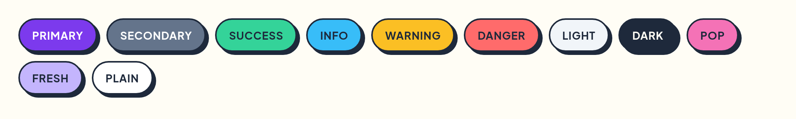

**[Play with it →](https://cleancookie.github.io/ja-ui/)** — every template and every
component, running live.

</div>

---

## Why

Bootstrap gets you moving fast, leaves every internal app looking the same, and asks you
to write `.btn .btn-primary` until you retire. Tailwind gets out of your way and makes you
rebuild a button forty times. ja-ui styles the HTML you were going to write anyway: a
`<button>` is a button, a `<dialog>` is the modal, `<details>` is the accordion. There is
no `.btn`, no `.card`, no `.modal`.

- **Zero runtime dependencies.** One stylesheet, one optional script. Install it next to
  anything else without a version fight.
- **No build step, no Tailwind.** Drop in a `<link>` and write markup. Semantic HTML *is*
  the API.
- **Everything is a CSS custom property.** Retheme the whole library from `:root`.
- **Accessible by default.** 44px touch targets, visible focus rings, `:user-invalid`
  rather than `:invalid`, `prefers-reduced-motion` respected, and styling that hangs off
  ARIA *state* — never off ARIA *naming*, which is translated.
- **No component ships a margin.** Padding and internal `gap` belong to the component;
  the space between things belongs to your page.
- **Your own CSS wins, without `!important`.** The entire library lives inside cascade
  layers, and unlayered CSS beats layered CSS regardless of specificity. Your stylesheet
  overrides ja-ui by existing. There is no `!important` anywhere in here, because it
  would invert that and start beating you.

## Install

ja-ui is not published to a registry — take the built files. There are two: a stylesheet,
and an optional script for the handful of things the platform cannot do.

Grab them from the playground build:

```bash
curl -O https://cleancookie.github.io/ja-ui/dist/ja-ui.min.css
curl -O https://cleancookie.github.io/ja-ui/dist/ja-ui.iife.js
```

…or build them yourself, which is what you want if you are changing anything:

```bash
git clone git@github.com:Cleancookie/ja-ui.git
cd ja-ui && npm install && npm run build   # writes dist/
```

## Use

The smallest working page. No classes, no wrappers, no initialisation:

```html
<!doctype html>
<html lang="en">
  <head>
    <meta charset="utf-8" />
    <meta name="viewport" content="width=device-width, initial-scale=1" />
    <link rel="stylesheet" href="ja-ui.min.css" />
    <script src="ja-ui.iife.js" defer></script>
  </head>
  <body>
    <main>
      <article>
        <h2>Deploy to production</h2>
        <p>This one is not reversible.</p>
        <button class="primary">Deploy</button>
        <button class="ghost">Cancel</button>
      </article>
    </main>
  </body>
</html>
```

That is the whole integration. The script is optional — everything above is styled
without it.

### Before and after

The rewrite is what the diff looks like:

```html
<!-- before -->
<button class="btn btn-primary btn-lg">Save</button>
<div class="modal fade" id="m" tabindex="-1"> …30 lines of divs… </div>

<!-- after -->
<button class="primary lg">Save</button>
<dialog id="m"> … </dialog>
```

For the intended typography, load the two webfonts — ja-ui itself makes zero network
requests, and any fallback still works:

```html
<link rel="preconnect" href="https://fonts.gstatic.com" crossorigin />
<link rel="stylesheet"
  href="https://fonts.googleapis.com/css2?family=Outfit:wght@500;700;800&family=Plus+Jakarta+Sans:wght@400;500;600;700&display=swap" />
```

## What you get for free

None of these need a class. They are the elements you would have reached for anyway.

| Write this | Get this |
| --- | --- |
| `<button>`, `<input type="submit">` | A themed button that lifts on hover and presses into the page. A submit button is styled as the primary action without a class. |
| `<a class="button">` | A link that looks like a button — the one place a class is unavoidable, because HTML has no other signal. |
| `<article>` | The card: surface, border, hard shadow, its own padding. `<header>` and `<footer>` inside it become the card's head and foot. |
| `<dialog>` + `showModal()` | The modal, with a styled `::backdrop`, scroll lock and an entry transition. `<form method="dialog">` closes it. `.drawer` turns it into an offcanvas panel. |
| `<details>` / `<summary>` | The accordion, chevron and all. Consecutive `<details>` join into a group, and `details[name]` makes them exclusive. |
| `[popover]` + `popovertarget` | The dropdown, in the top layer, with light dismiss. `popover="hint"` is the tooltip. |
| `<table>` | Solid ink header, zebra rows on `.striped`, sort arrows from `th[aria-sort]`, and a scroll shell from `[role="region"]`. |
| `<form>`, `<label>`, `<input>`, `<select>`, `<textarea>`, `<fieldset>` | Inputs that light up on focus instead of glowing. Checkboxes, radios, `[role="switch"]`, range, colour and file inputs are all restyled. Errors show on `:user-invalid`, so an untouched required field is not red on load. |
| `<progress>`, `<meter>` | The bar. `<progress>` with no `value` is the indeterminate stripe. |
| `<nav>` | The nav bar. `[aria-current="page"]` marks the current item; `nav.sticky` in `<header>` pins it. |
| `<blockquote>`, `<code>`, `<pre>`, `<kbd>`, `<mark>`, `<abbr title>` | Pull quote, inline code, ink-filled code block, physical keycaps, highlighter, dotted abbreviation. |
| `<figure>` / `<figcaption>` | Framed media with a caption. |
| `<dl>` | A definition list, and a two-column key/value grid when its rows are wrapped in `<div>`. |
| `<search>`, `<input type="search">` | The search bar. |
| `[role="tablist"]` / `[role="tab"]` | Tabs, with the full APG keyboard model wired by the script. |

| Buttons | Cards |
| --- | --- |
|  | 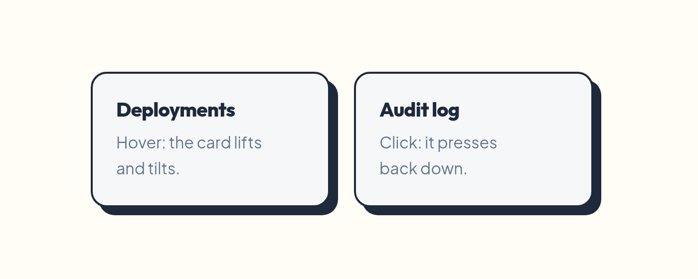 |

The movement is deliberately small — 1px each way, so a click travels under 3px. The
shadow grows or shrinks by exactly as much as the element moves, which pins its far
corner and keeps the light source still; that, rather than the distance, is what makes
the press read as physical. Tune it with `--ja-lift` and `--ja-press`.

## Variants

Variants are bare, single-word classes on two axes, and they compose:
`class="danger outline"`, `class="primary lg"`.

| Axis | Classes |
| --- | --- |
| **Colour** | `.primary` `.secondary` `.success` `.info` `.warning` `.danger` `.light` `.dark` `.pop` `.fresh` `.plain` |
| **Treatment** | `.outline` `.soft` `.ghost` |
| **Size** | `.sm` `.lg` |
| **Controls** | `a.button`, `.icon` (icon-only) |
| **Content** | `article.interactive` (lifts on hover), `.lead`, `.measure` |
| **Dialog** | `dialog.drawer` plus one of `.start` `.end` `.top` `.bottom` |
| **Navigation** | `nav.sticky`, `.breadcrumb`, `.pagination`, `ul.list`, `a.skip` |
| **Feedback** | `.callout` `.badge` `.toasts` `.toast` `.spinner` `.skeleton` |
| **Table** | `.striped` `.compact` `.bordered` `.numeric` |
| **Accessibility** | `.visually-hidden` |
| **Non-native components** | `.command-palette`, `[data-ja-datatable]` |

That is the complete inventory. Everything else is an element, an attribute, or an ARIA
state.

```html
<button class="danger outline">Delete</button>
<span class="badge success">Live</span>
<div class="callout warning">Your trial ends on Friday.</div>
```

**Why one class works everywhere.** A colour variant sets exactly two custom properties
and never writes a raw declaration:

```css
.danger { --ja-accent: var(--ja-danger); --ja-accent-fg: var(--ja-danger-fg); }
```

Every tintable element reads that accent with its own default as the fallback:

```css
button { background: var(--ja-accent, var(--ja-surface)); }
```

One indirection, and `.danger` behaves identically on a `button`, an `a.button`, an
`input[type=submit]`, a callout and a badge — without any of them escalating specificity.
`.plain` sets the accent back to `initial`, the guaranteed-invalid value, which falls the
element through to its own default.

Some intent is already in the markup and takes no class at all: a form's submit button is
the primary action, a dialog's `[autofocus]` button is its default action, and a
`[command="close"]` button is quiet. Those rules live in the `ja.elements` layer, one
below the variant classes, so `<button type="submit" class="danger">` still comes out red.

| | |
| --- | --- |
| 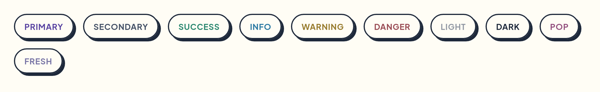 | 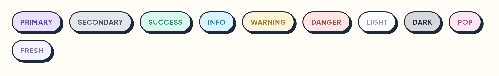 |
|  | 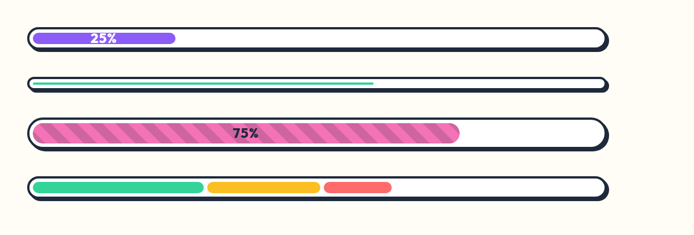 |
| 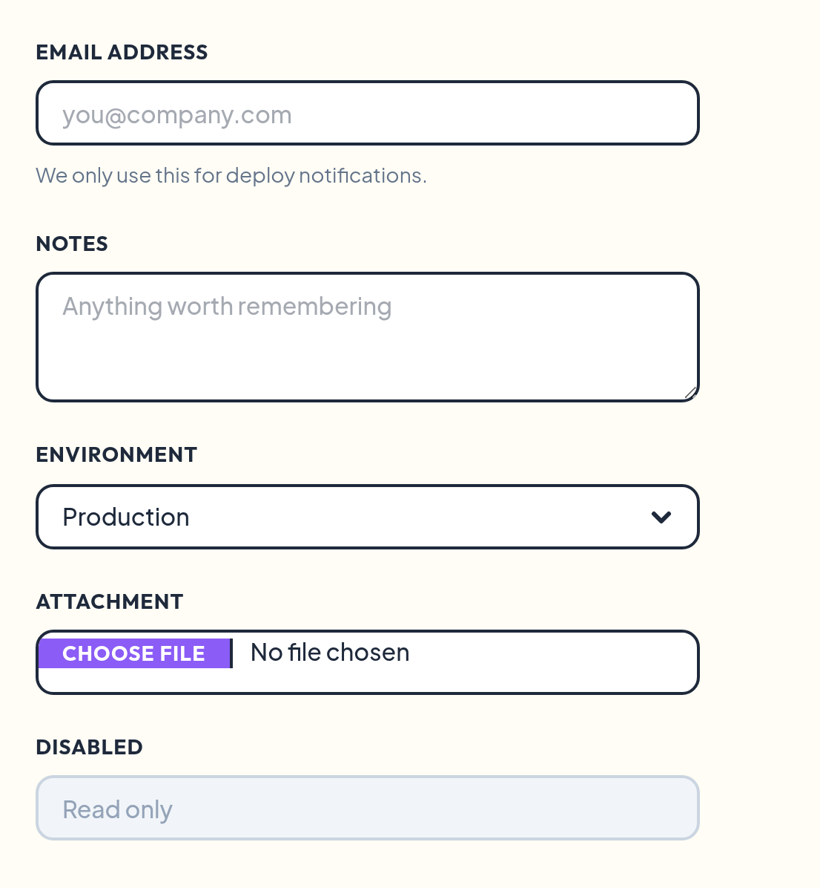 | 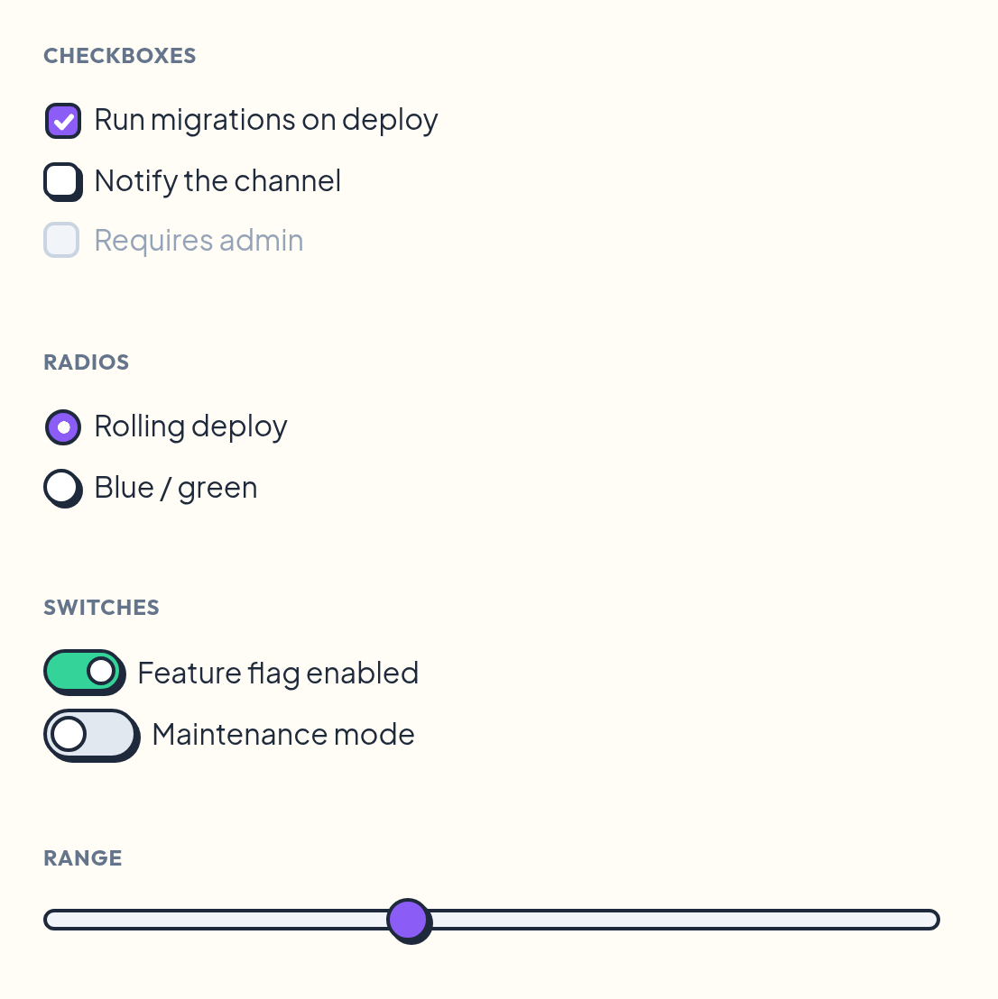 |
|  | 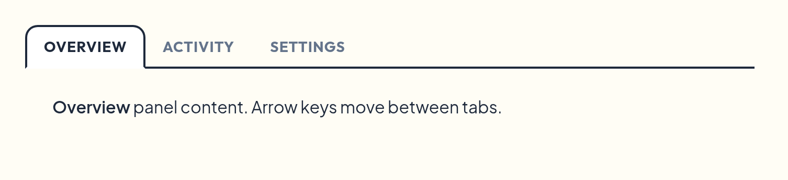 |

## Theming

Two skins, three theme states, one set of tokens. Not one element rule changes between
them.

### Light, dark and system

Three states, never a boolean — a boolean breaks the user who toggled once and later
changed their OS preference.

| `data-theme` | Result |
| --- | --- |
| *(unset)* | Follow the operating system |
| `light` | Forced light |
| `dark` | Forced dark |

The attribute's primary home is `<html>`:

```html
<html data-theme="dark" data-style="brutal">
```

That is not arbitrary. `color-scheme` does **not** propagate from `<body>` to the
viewport, so a body-level theme leaves you with a light scrollbar on a dark page — and
the anti-FOUC script has no `<body>` to write to yet.

The selectors are bare (`[data-theme="dark"]`, not `:root[data-theme="dark"]`), so the
attribute also works on `<body>` and **on any subtree**. An `<aside data-theme="dark">`
inside a light page is a supported, first-class thing: custom properties substitute at
use time, so a token declared once on `:root` resolves its `light-dark()` against the
`color-scheme` of the element using it.

Set it from a `<html>` attribute, from a `[data-ja-theme-toggle]` button, or from JS:

```js
import { setTheme, toggleTheme, setStyle } from 'ja-ui';

toggleTheme();          // light <-> dark, remembered in localStorage
setTheme('system');     // back to following the OS
setStyle('brutal');     // switch skin
```

The choice is stored under `ja-ui:theme` and `ja-ui:style`. To avoid a flash of the wrong
theme, replay it in `<head>`, before the stylesheet paints:

```html
<script>
  try {
    const t = localStorage.getItem('ja-ui:theme');
    if (t && t !== 'system') document.documentElement.dataset.theme = t;
    const s = localStorage.getItem('ja-ui:style');
    if (s && s !== 'default') document.documentElement.dataset.style = s;
  } catch {}
</script>
```

The default skin's dark theme is **One Dark**: `#282c34` paper, `#abb2bf` ink, and borders
that step back to `#3e4451` so the 2px outlines read as structure rather than glare. It is
not an inversion — an ink-filled block (a table head, a `<pre>`) goes deeper via
`--ja-ink-fill` instead of flipping to a light slab mid-page.

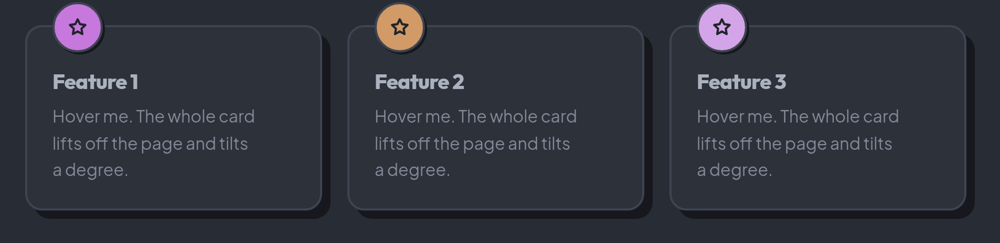

### Skins

| `data-style` | Look |
| --- | --- |
| *(unset)* | **Playful Geometric** — slate ink, 2px borders, 8–16px radii, pill buttons |
| `brutal` | **Neo-brutalism** — pure black, 4px borders, zero radius, uppercase, deeper shadows, linear easing |

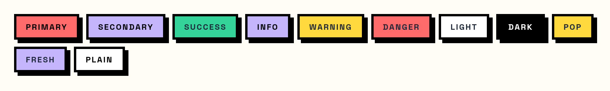

Both skins and both themes, from the same markup:

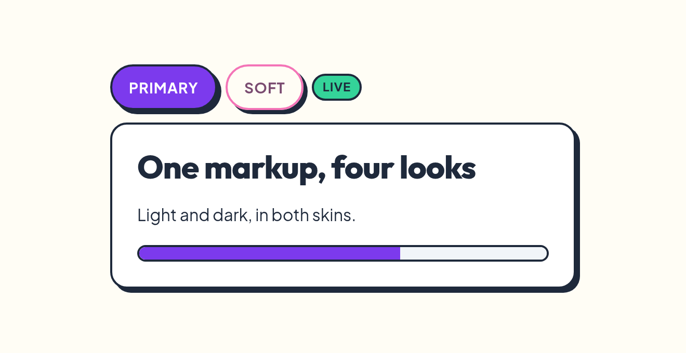

### Overriding tokens

Every visual decision in the library is a `--ja-*` custom property in
[`src/styles/tokens.css`](src/styles/tokens.css). Override the handful you care about and
the rest follows — hover, active, subtle and emphasis states are mixed from the base
colour with `color-mix()`.

```css
:root {
  --ja-primary: #0ea5e9;      /* every primary button, link and focus ring follows */
  --ja-radius: 4px;           /* tighter corners everywhere */
  --ja-border-width: 1px;     /* calmer borders */
  --ja-shadow: 2px 2px 0 0 var(--ja-shadow-color);
  --ja-font-heading: "Inter", sans-serif;
  --ja-control-height: 2.25rem;
}
```

Tokens are declared twice: a plain light value, then the real `light-dark()` declaration.
`light-dark()` is not a graceful no-op — an unsupported colour function invalidates the
whole declaration and the element gets no colour at all — so the plain value underneath
is the fallback. Follow the same pattern in your own overrides.

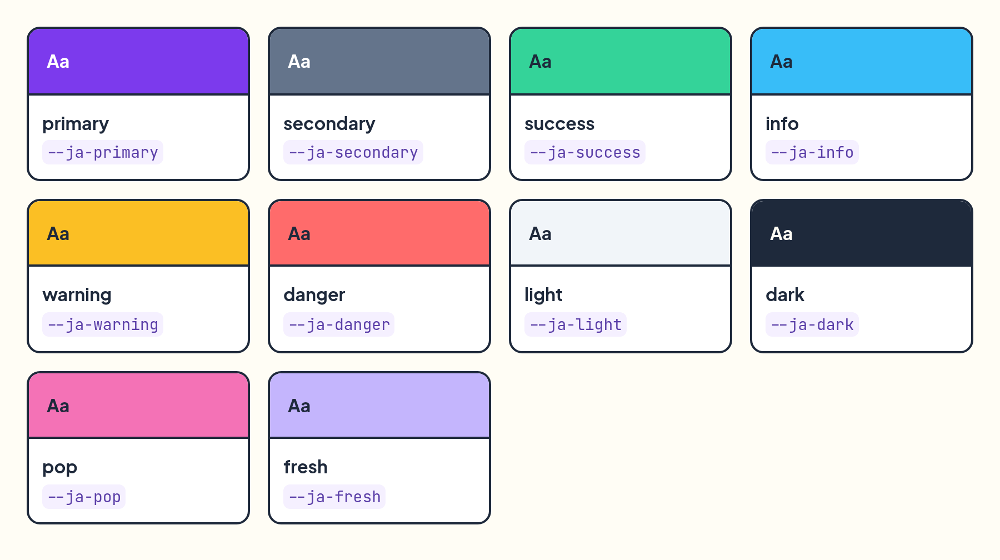

## JavaScript

Optional, ~12kb gzipped, no dependencies. Note how little there is: `<dialog>`,
`<details>` and `[popover]` need **no JavaScript at all** — they are the platform, and the
script never touches them.

What remains exists for exactly four things:

1. **The invoker-command fallback.** `command` / `commandfor` is the right way to open a
   dialog or a popover from a button, and an unsupported command button is *dead* — so a
   click listener stands in where the engine has not shipped it yet.
2. **The tabs keyboard model.** HTML has no tabs element, so `[role="tablist"]` gets the
   W3C APG arrow-key behaviour from a delegated listener.
3. **Toasts.** There is nothing to append them to until you make one.
4. **The two components with no native equivalent** — the command palette and the data
   table.

Everything is wired by `autoInit()` on load. Opt out with `<body data-ja-no-autoinit>`.

```ts
// Components
class Component                    // shared plumbing: getInstance, getOrCreateInstance, dispose
class CommandPalette extends Component   // show, hide, toggle, setItems, isVisible
class DataTable extends Component        // refresh, autoFitColumn, autoFitAll, rowCount

// Fuzzy matching — exported because the palette's ranking is useful on its own
function fuzzyMatch(needle, haystack)
function fuzzyFilter(needle, items, key?)
function parseQuery(query)

// Tabs
function initTabs()                // idempotent; auto-init calls it
function selectTab(tab, options?)  // false if a listener cancelled

// Toasts
function toast(message, options?)  // { variant, duration, placement, dismissible }
function dismissToast(element)

// Invoker commands
function initInvokers()            // no-op where the platform implements them
const hasNativeInvokers

// Theme
function getTheme() / getResolvedTheme() / setTheme(t) / toggleTheme()
function getStyle() / setStyle(s) / restoreTheme()

// Lifecycle
function autoInit() / resetAutoInit()
const version
```

Events are namespaced `ja:<name>:<type>` and bubble: `ja:theme:changed`,
`ja:style:changed`, `ja:tabs:show` / `shown`, `ja:toast:shown` / `hide`. `show` and `hide`
are cancelable. TypeScript definitions ship in `dist/ja-ui.d.ts`.

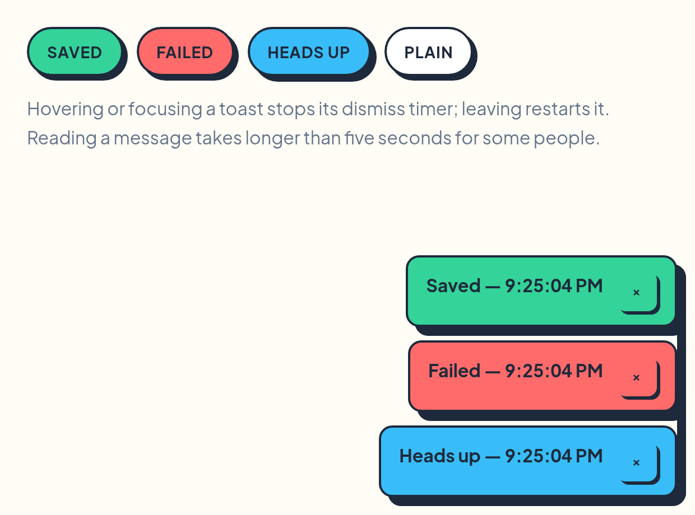

### Command palette

One of the two components with no native equivalent. It is built for desktop-shaped apps:
a global shortcut, fuzzy search over everything you can do, Enter to run it.

```js
import { CommandPalette } from 'ja-ui';

const palette = new CommandPalette('#palette', {
  hotkey: 'mod+k',                       // ⌘K on macOS, ctrl-K everywhere else
  items: () => [                         // a function is re-read on every open
    { label: 'Deploy to staging', description: 'acme-web', group: 'Actions', hint: '⌘D' },
    { label: 'Open user settings', group: 'Settings', keywords: 'profile theme' },
    ...files.map((path) => path),        // plain strings are items too
  ],
  onSelect: (item) => run(item),
});
```

Or entirely from markup — a palette with a hotkey is constructed by auto-init:

```html
<div class="command-palette" id="palette" data-ja-hotkey="mod+k"
     data-ja-items="#palette-items"></div>
<script type="application/json" id="palette-items">[{ "label": "Deploy" }]</script>
```

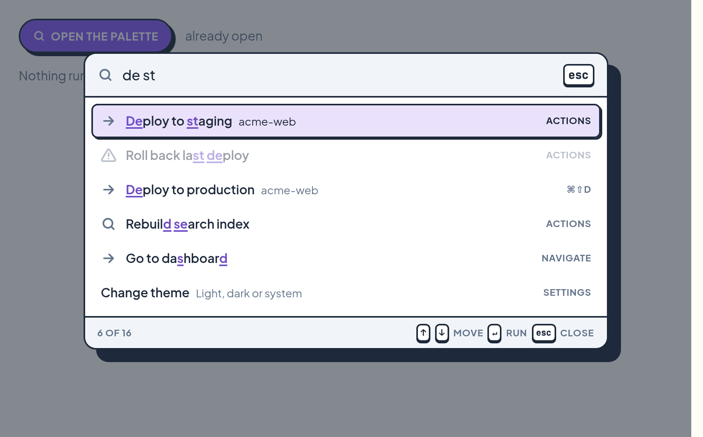

| | |
| --- | --- |
| **Matching** | Subsequence search with fzf's bonuses — word boundaries, camelCase, tight runs beat scattered ones. Space-separated terms are ANDed, so `usr set` finds *User settings*. `description`, `keywords` and `group` are searched too, at a lower weight; `label` is what gets highlighted. |
| **Keys** | `↑`/`↓` and `ctrl-J`/`ctrl-K` (also `ctrl-N`/`ctrl-P`) move, `PageUp`/`PageDown` and `ctrl-U`/`ctrl-D` page, `Home`/`End` jump, `Enter` runs, `Escape` closes. The selection wraps and skips `disabled` items. |
| **Mouse** | A pointer already resting over the list when the palette opens does **not** take the selection — hover only takes over once the mouse genuinely moves. Opening under the cursor never runs the wrong thing. |
| **Motion** | One highlight block slides between rows; it jumps rather than animating when the result set changes, because that is not a move. Keyboard navigation scrolls instantly while the highlight animates — a smooth-scrolling list racing an animating highlight is what makes most palettes feel soupy on a held-down arrow key. |
| **Scale** | Only the visible window is in the DOM, and rows are recycled as you scroll. Each keystroke re-filters inside the previous result set, so a 100,000-item list filters in ~25 ms on the first character and under 10 ms after that. |

Options: `items`, `hotkey`, `placeholder`, `emptyText`, `groups`, `limit`, `keepOpen`,
`backdrop`, `keyboard`, `clearOnClose`, `overscan`, `onSelect`. Events:
`ja:command-palette:show` / `shown` / `hide` / `hidden`, plus `filter`, `highlight` and a
cancelable `select` carrying `{ item, index, query }`.

Row heights come from CSS (`--ja-command-palette-item-height`,
`--ja-command-palette-header-height`) and are measured by the JS, so they must stay in
`px`.

### Data table

A plain `<table>` remains the dumb markup-first table, and it is styled for you. `DataTable`
is the heavy-duty sibling for spreadsheet-sized data: rows and columns are virtualised,
every column starts at a fixed width, dragging its edge resizes it, and a double-click
auto-sizes it up to a cap so a giant JSON blob does not blow the whole sheet open.

```js
import { DataTable } from 'ja-ui';

new DataTable('#orders', {
  columnCount: 1000,
  rowCount: 1000000,
  defaultColumnWidth: 160,
  maxAutoWidth: 320,
  getColumnLabel: (index) => `Field ${index + 1}`,
  getCell: (rowIndex, columnIndex) => `R${rowIndex + 1} · C${columnIndex + 1}`,
});
```

If your data already fits in JSON, the constructor also reads `data-ja-columns` /
`data-ja-rows` selectors pointing at `<script type="application/json">` blocks:

```html
<script type="application/json" id="dt-columns">["SKU","Name","Warehouse"]</script>
<script type="application/json" id="dt-rows">[["A-100","Travel mug","Manchester"]]</script>
<div id="orders" data-ja-datatable data-ja-columns="#dt-columns" data-ja-rows="#dt-rows"></div>
```

It emits `ja:datatable:columnresize` / `columnresized`, `ja:datatable:autosize` /
`autosized`, and `ja:datatable:selectall` / `selectallchanged`.

## Migrating from the class-based version

This is a breaking rewrite. The old library mirrored Bootstrap 5's class names; this one
does not have them. Port markup with the table below.

| Was | Is now |
| --- | --- |
| `.btn .btn-primary` | `<button class="primary">` |
| `.btn .btn-outline-danger` | `<button class="danger outline">` |
| `.card` / `.card-body` | `<article>` |
| `.modal` + JS | `<dialog>` + `showModal()` |
| `.offcanvas` | `<dialog class="drawer end">` |
| `.accordion` / `.collapse` | `<details>` / `<summary>` |
| `.dropdown` / `.dropdown-menu` | `[popover]` + `popovertarget` |
| `.nav-tabs` | `[role="tablist"]` + the APG keyboard model |
| `.alert` | `.callout` |
| `.progress` / `.progress-bar` | `<progress>` |
| `.form-control` / `.form-label` | `<input>` / `<label>` |
| `.form-select` | `<select>` |
| `.breadcrumb` / `.pagination` | `<nav><ol>` + `aria-current="page"` |
| `.list-group` | `<ul role="list" class="list">` |
| `.table` | `<table>` |
| `.row` / `.col-6` / `.d-flex` / `.gap-3` / `.p-4` | **gone** |

**The utility classes and the 12-column grid are gone**, with no replacement and no
deprecation path. ja-ui styles content, not layout: pages write their own layout CSS. Grid
and flexbox are two lines each, they belong to your page rather than to a library, and
carrying a responsive utility layer was two thirds of the old stylesheet — dropping it is
most of the fall from ~30kb of CSS to 12.6kb.

The `data-ja-*` toggle and target attributes are gone too. The whole set the library still
reads is `data-theme`, `data-style`, `data-ja-theme-toggle`, `data-ja-no-autoinit`,
`data-ja-hotkey` and `data-ja-activation="manual"` on a tablist.

## Templates

Complete pages, in [`examples/`](examples). Open any of them directly in a browser after
`npm run build`.

| | |
| --- | --- |
| [Admin dashboard](examples/dashboard.html) | [Content manager](examples/cms.html) |
| 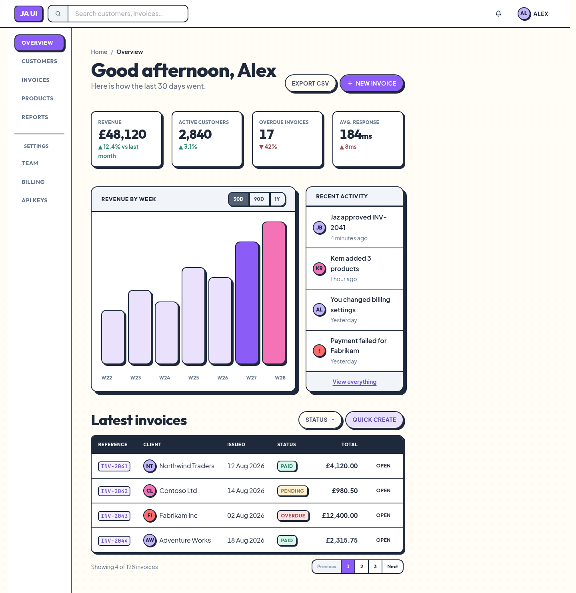 | 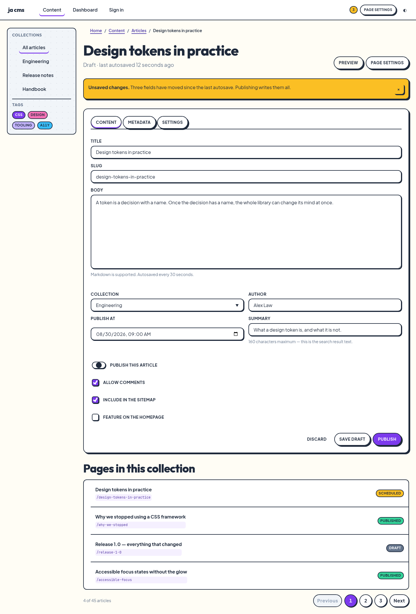 |
| [Marketing page](examples/marketing.html) | [Pricing](examples/pricing.html) |
| 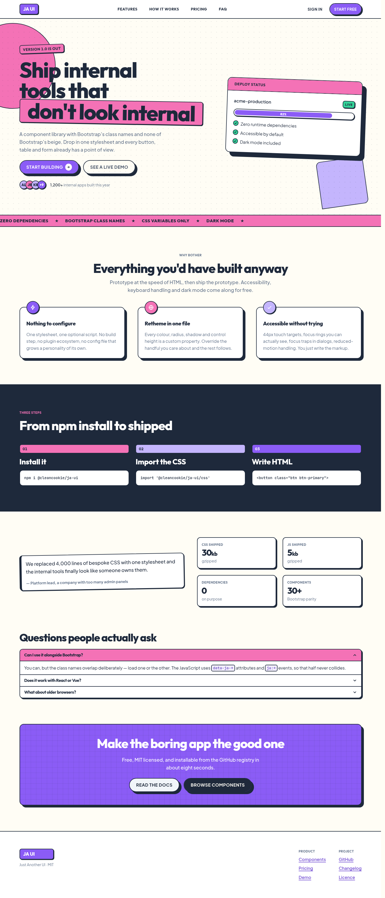 | 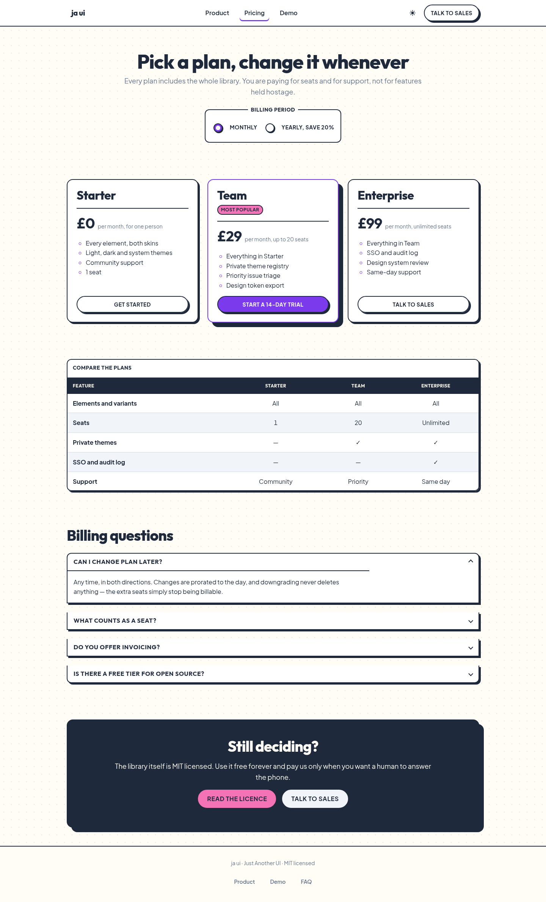 |
| [E-commerce](examples/shop.html) | [Sign in](examples/signin.html) |
| 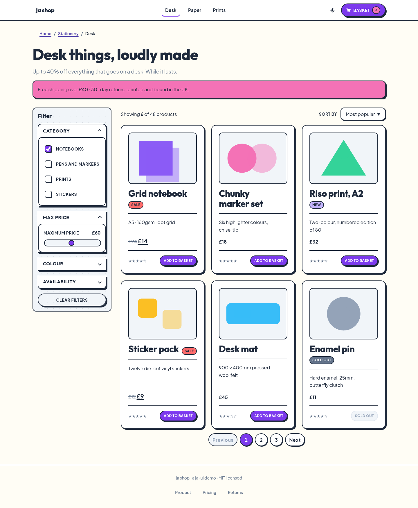 | 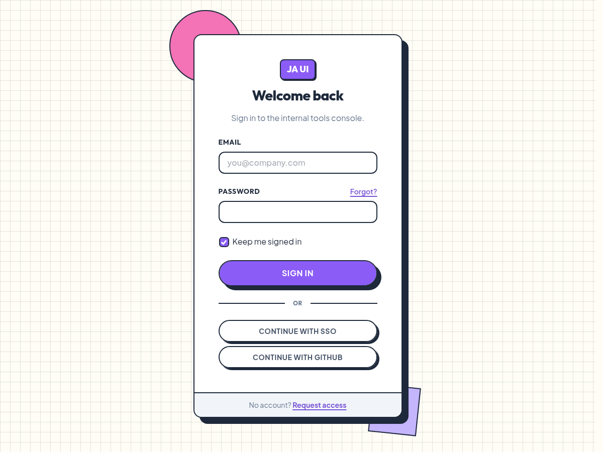 |

## Browser support

Modern evergreen browsers. There is no IE support, no float grid and no clearfix.

**Required** — the library assumes these and does not guard them: `<dialog>`,
`::backdrop`, `:has()`, `@layer`, `color-mix()`, `oklch()`, `:user-invalid`, `<search>`
and `@container`.

**Degrades gracefully** — used, but with a fallback underneath:

| Feature | Without it |
| --- | --- |
| `light-dark()` | Every token falls back to its plain declaration: the light theme, everywhere. |
| `details[name]` | The accordion panels open independently instead of exclusively. |
| `@starting-style` + `allow-discrete` | Dialogs and popovers snap open instead of transitioning. |
| `field-sizing`, `closedby`, `appearance: base-select` | The browser's own control behaviour, unstyled in that one respect. |
| Popover API, anchor positioning | Guarded behind `@supports`. |
| `command` / `commandfor` | The shipped JS click listener stands in — an unsupported command button would otherwise be dead. |

Not used at all: `interestfor`, `if()`, `@function`, `interpolate-size`, scroll-driven
animations.

## Development

```bash
npm install
npm run dev             # Storybook on :6006
npm run build           # dist/ — css, esm, iife, types
npm run smoke           # drive every JS component in a real browser
npm run perf            # the palette and data-table benchmarks
npm run shots           # rebuild the screenshots in site/images/
npm run site            # assemble the site into docs/ (build output, gitignored)
npm run site:serve      # preview it on :6008
```

Nothing is generated: the CSS is authored by hand, one file per family of native
elements. The old `src/styles/generated/` tree went with the utility classes and the grid.

```
src/
  styles/
    index.css        the layer order, then the imports
    tokens.css       every visual value, both skins, all three theme states
    reset.css        :where()-flattened normalize
    elements/        one file per family of native elements
    variants.css     the intent classes — token remaps only
    components/      command palette, data table — the only two non-native ones
  js/                only what the platform genuinely cannot do
tools/               screenshots, GIFs, the smoke test, the site build
examples/            standalone template pages
site/                the playground landing page and its images
stories/             Storybook
```

The playground at [cleancookie.github.io/ja-ui](https://cleancookie.github.io/ja-ui/) is
built from source and deployed by `.github/workflows/pages.yml` on every push to `main` —
merging is publishing, and the Actions tab is the deploy log. `docs/` is gitignored build
output: run `npm run site` to preview, never to publish. Keep everything base-path
agnostic, since the site is served from `/<repo>/`.

[ARCHITECTURE.md](ARCHITECTURE.md) is the contract — the layer order, the variant rules,
the feature-gating table. [CONTRIBUTING.md](CONTRIBUTING.md) is how to work in here.

## Licence

MIT
