<div align="center">

# ja-ui

**Just Another UI** — a zero-dependency component library with Bootstrap 5's class names
and none of Bootstrap's beige.

Cream paper, ink borders, hard offset shadows, and buttons that physically press.

[](https://github.com/Cleancookie/ja-ui/pkgs/npm/ja-ui)
[](LICENSE)


**[Play with it →](https://cleancookie.github.io/ja-ui/)** — every template and every
component, running live.

</div>

---

## Why

Bootstrap gets you moving fast and leaves every internal app looking the same. Tailwind
gets out of your way and makes you rebuild a button forty times. ja-ui takes Bootstrap's
vocabulary — `.btn`, `.card`, `.row`, `.col-6`, `.form-control` — and gives it a
deliberate visual identity, so a prototype is already production-presentable.

- **Zero runtime dependencies.** One stylesheet, one optional script. Install it next to
  anything else without a version fight.
- **No Tailwind, no build step.** Write plain HTML. The class names are the API.
- **Everything is a CSS custom property.** Retheme the whole library from `:root`.
- **Accessible by default.** 44px touch targets, visible focus rings, focus traps in
  dialogs, `prefers-reduced-motion` respected, ARIA wired up by the components.
- **No component ships a margin.** Spacing is the parent's job — use the utilities,
  `.vstack` / `.hstack`, or the grid.

## Install

ja-ui is not published to a registry yet — take the built files. They are two:
a stylesheet, and an optional script for the interactive components.

Grab them from the playground build:

```bash
curl -O https://cleancookie.github.io/ja-ui/dist/ja-ui.min.css
curl -O https://cleancookie.github.io/ja-ui/dist/ja-ui.iife.js
```

…or build them yourself, which is what you want if you are changing anything:

```bash
git clone git@github.com:Cleancookie/ja-ui.git
cd ja-ui && npm install && npm run build   # writes dist/
```

## Use

Drop the two files in and write markup — no bundler involved:

```html
<link rel="stylesheet" href="ja-ui.min.css" />
<script src="ja-ui.iife.js" defer></script>
```

With a bundler, point imports at the built files (or at the checkout):

```js
import './vendor/ja-ui/ja-ui.css';   // the styles
import './vendor/ja-ui/ja-ui.js';    // optional — only for interactive components
```

The JavaScript examples below write the specifier as `ja-ui` for readability — point it
at wherever you put the files, or at an alias.

Then write markup you already know:

```html
<div class="card">
  <div class="card-body">
    <h5 class="card-title">Deploy to production</h5>
    <p class="card-text text-muted">This one is not reversible.</p>
    <div class="d-flex gap-2">
      <button class="btn btn-primary">Deploy</button>
      <button class="btn btn-ghost">Cancel</button>
    </div>
  </div>
</div>
```

For the intended typography, load the two webfonts (any fallback still works):

```html
<link rel="stylesheet"
  href="https://fonts.googleapis.com/css2?family=Outfit:wght@500;700;800&family=Plus+Jakarta+Sans:wght@400;500;600;700&display=swap" />
```

## The feel

Buttons lift toward you, then press into the page and cover their own shadow. Cards lift
and tilt a degree. Nothing fades politely.

The movement is deliberately small — 1px each way, so a click travels under 3px. The
shadow grows or shrinks by exactly as much as the element moves, which pins its far
corner and keeps the light source still; that, rather than the distance, is what makes
the press read as physical. Tune it with `--ja-lift` and `--ja-press`, and keep
`--ja-press` + `--ja-shadow-active`'s offset equal to `--ja-shadow`'s. The `brutal` skin
sets these much higher on purpose.

| Buttons | Cards |
| --- | --- |
|  | 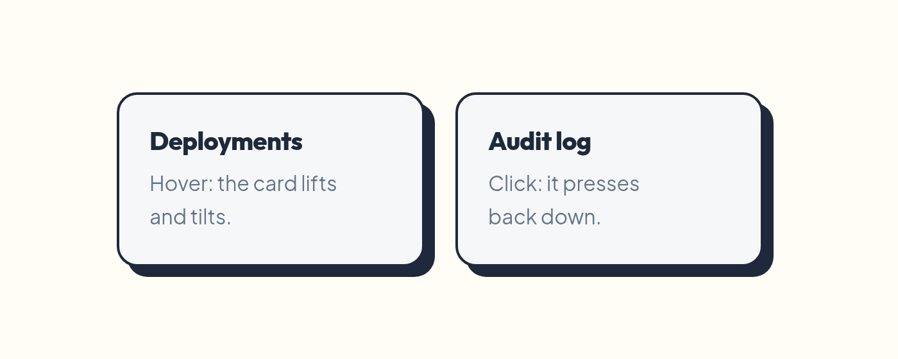 |

Two skins and two themes, from the same markup — flip `data-ja-style` and `data-ja-theme`
on `<html>`:

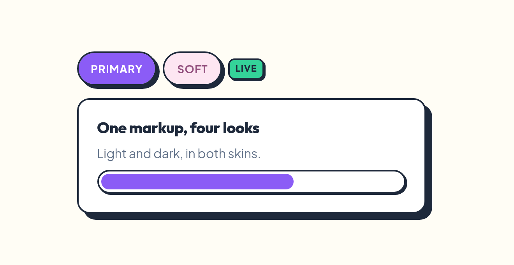

## Components

Bootstrap 5 parity, minus the JS-heavy widgets (no carousel, scrollspy, tooltip or
popover yet), plus a few additions.

<table>
<tr>
<td width="50%">

**Buttons** — solid, outline, soft, ghost, link, icon, groups, toggles

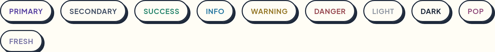


</td>
<td width="50%">

**Cards** — hoverable, coloured shadows, blob corners, icon discs

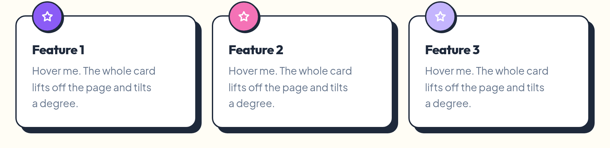

</td>
</tr>
<tr>
<td>

**Forms** — inputs light up instead of glowing on focus

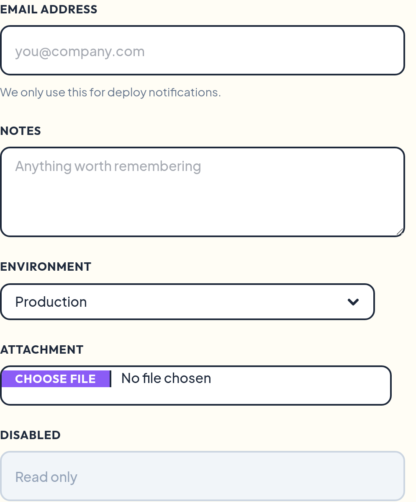

</td>
<td>

**Checks, radios & switches**

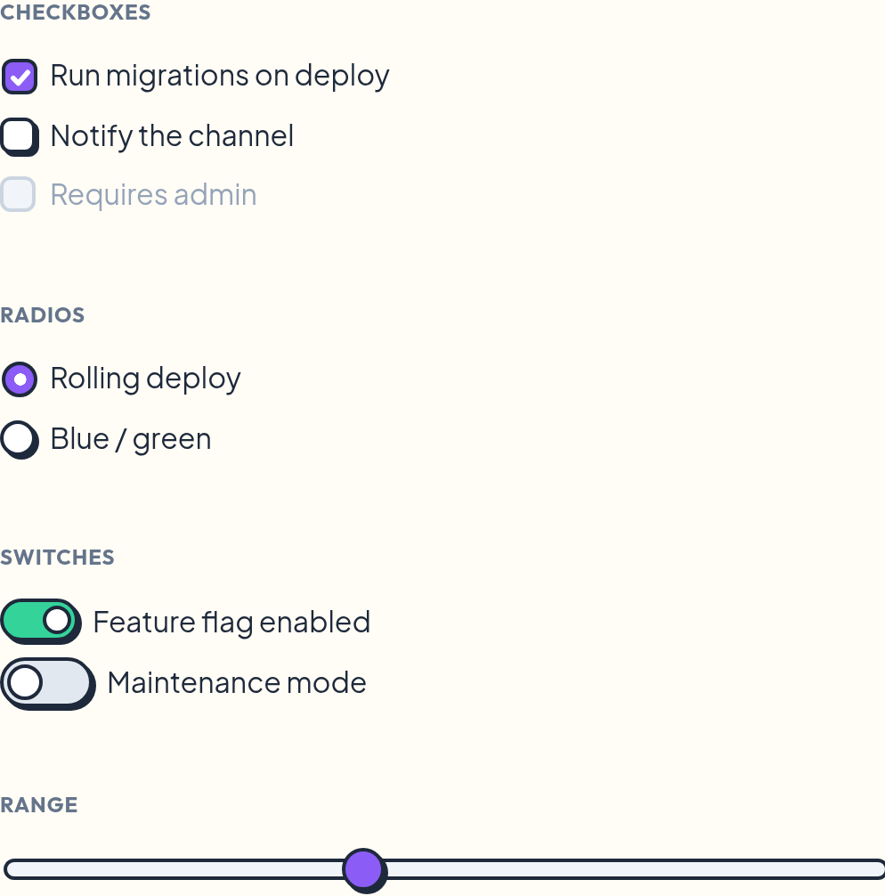

</td>
</tr>
<tr>
<td>

**Tables** — solid ink header, striped, hoverable, `.table-card`

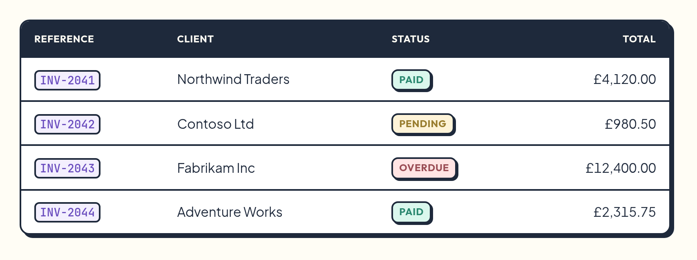

</td>
<td>

**Alerts** — a solid accent block, not a tint

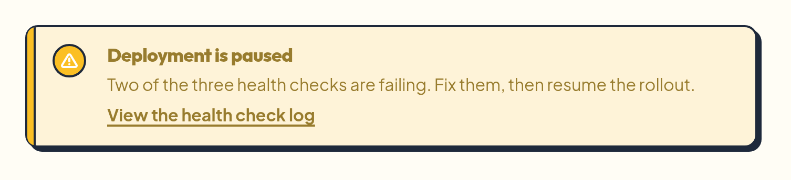

</td>
</tr>
<tr>
<td>

**Badges, progress, spinners, placeholders**


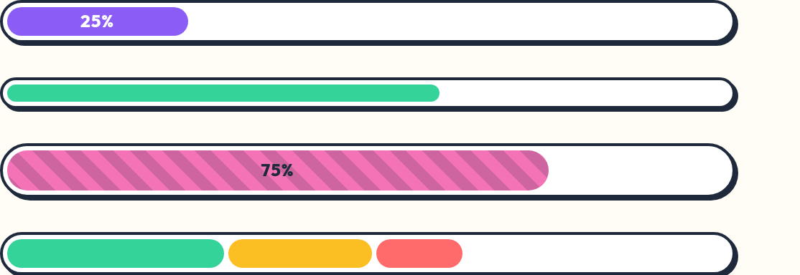

</td>
<td>

**Navigation** — tabs, pills, underline, navbar, dropdown, pagination


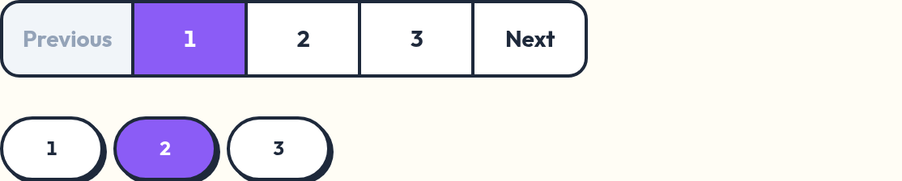

</td>
</tr>
<tr>
<td colspan="2">

**Command palette** — an fzf-style ctrl-P for serious apps: fuzzy ranking, a highlight that
slides between rows, and virtualised rendering for lists in the hundred thousands


</td>
</tr>
</table>

<details>
<summary><strong>Everything in the box</strong></summary>

| | |
| --- | --- |
| **Layout** | Containers, 12-column flex grid, gutters, `.vstack` / `.hstack`, ratios, sticky helpers |
| **Content** | Typography, display headings, lead, blockquote, code, `kbd`, figures, images, tables |
| **Forms** | Inputs, textarea, select, file, colour, range, checks, radios, switches, floating labels, input groups, validation |
| **Components** | Accordion, alert, badge, breadcrumb, buttons, button group, card, close button, collapse, command palette, data table, dropdown, list group, modal, navbar, navs & tabs, offcanvas, pagination, placeholders, progress, spinners, toasts |
| **Decoration** | Patterns (dots, grid, stripes, cross), stickers, rotations, squiggle dividers, marquee, avatars, stat tiles, text outline & highlight |
| **Utilities** | Spacing (0–8), display, flex, gap, position, sizing, borders, radii, shadows, colours, typography, overflow, visibility — all responsive, all logical-property based |
| **Extra variants** | `.btn-soft-*`, `.btn-ghost`, `.btn-flat`, `.btn-icon`, `.pop` and `.fresh` colours, `.card-hover`, `.table-card`, `.pagination-pills` |

</details>

## Templates

Complete pages built only from ja-ui classes, in [`examples/`](examples). Open any of them
directly in a browser after `npm run build`.

| | |
| --- | --- |
| [Admin dashboard](examples/dashboard.html) | [Content manager](examples/cms.html) |
| 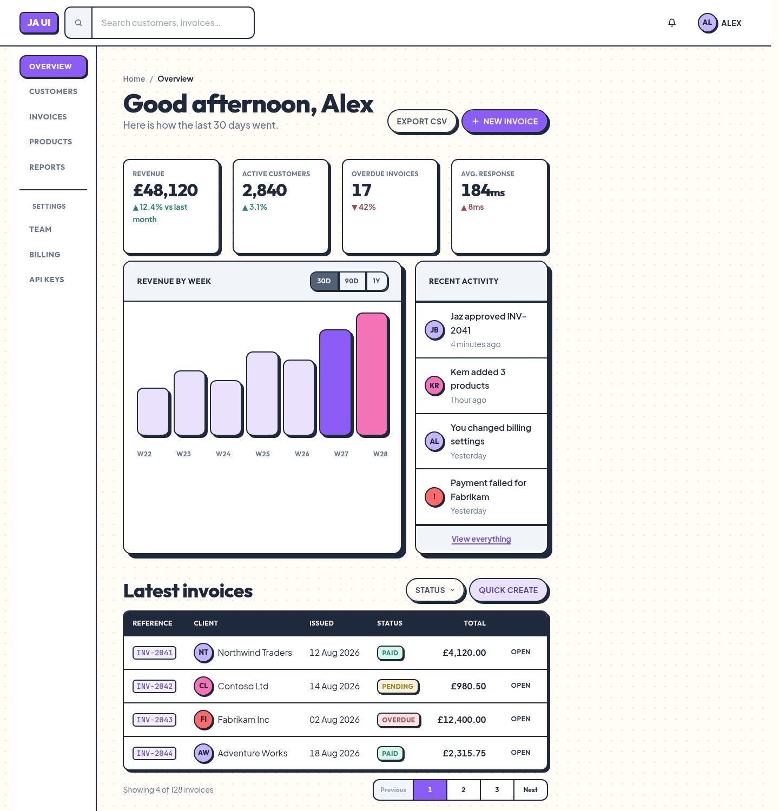 | 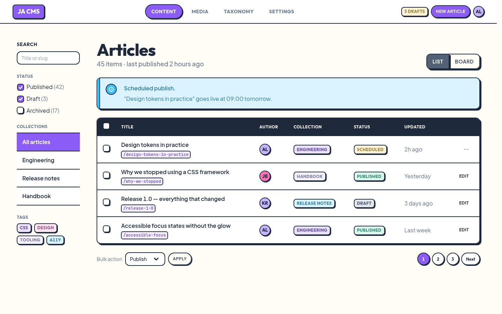 |
| [Marketing page](examples/marketing.html) | [Pricing](examples/pricing.html) |
|  | 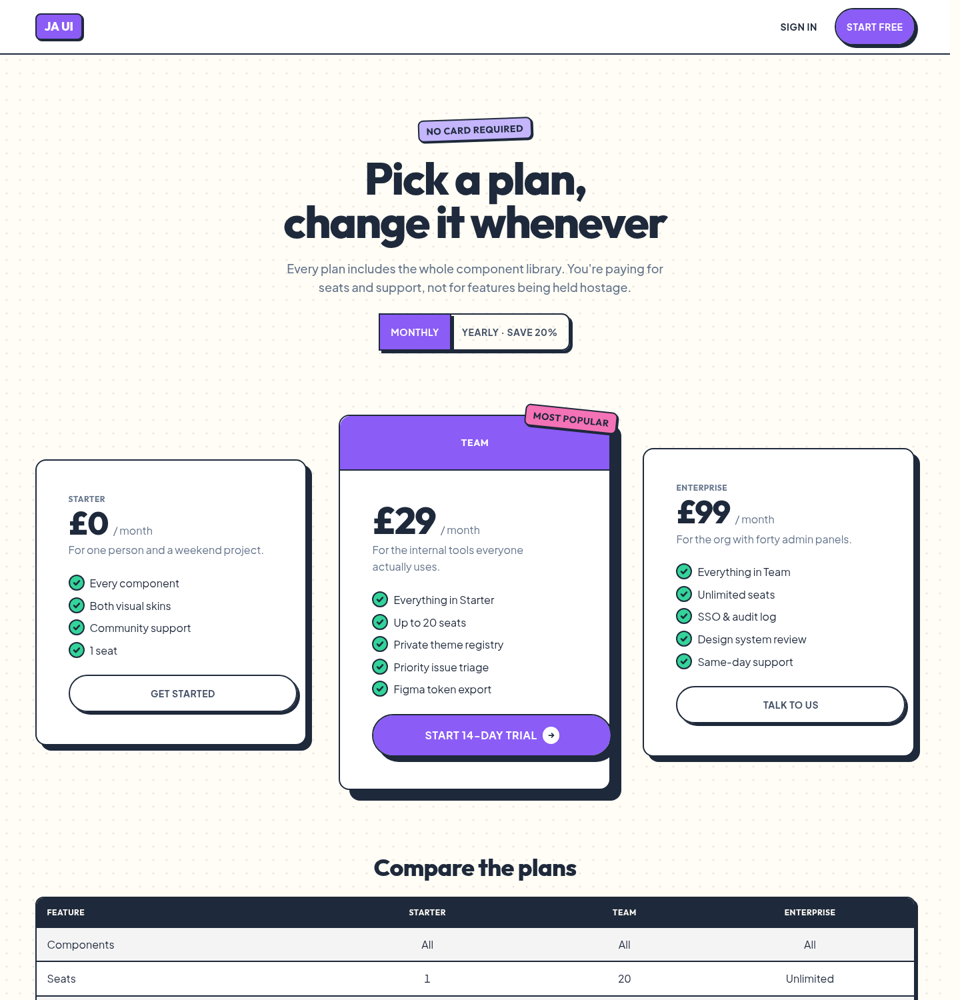 |
| [E-commerce](examples/shop.html) | [Sign in](examples/signin.html) |
| 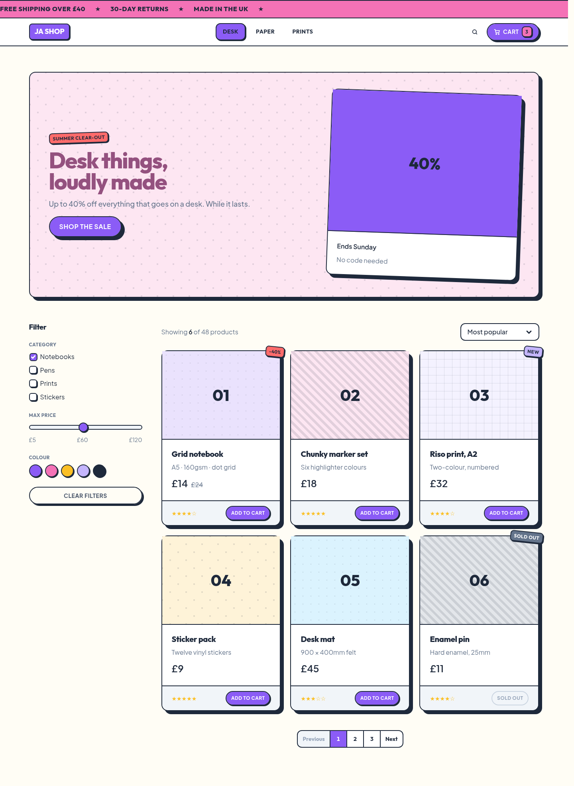 |  |

## Theming

Every visual decision is a custom property on `:root`. Override the handful you care about
and the rest follows — hover, active, subtle and emphasis states are all mixed from the
base colour.

```css
:root {
  --ja-primary: #0ea5e9;      /* every primary button, link and focus ring follows */
  --ja-radius: 4px;           /* tighter corners everywhere */
  --ja-border-width: 1px;     /* calmer borders */
  --ja-shadow: 2px 2px 0 0 var(--ja-shadow-color);
  --ja-font-heading: "Inter", sans-serif;
  --ja-control-height: 2.25rem;
}
```

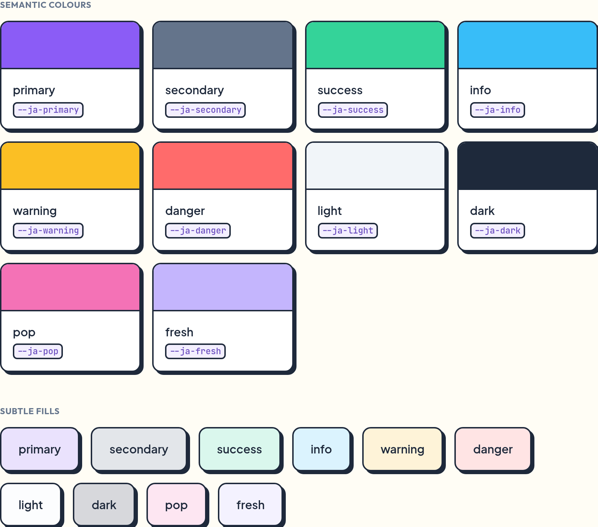

### Skins

| `data-ja-style` | Look |
| --- | --- |
| *(unset)* | **Playful Geometric** — slate ink, 2px borders, 8–16px radii, pill buttons |
| `brutal` | **Neo-brutalism** — pure black, 4px borders, zero radius, uppercase, deeper shadows |

```html
<html data-ja-style="brutal" data-ja-theme="dark">
```

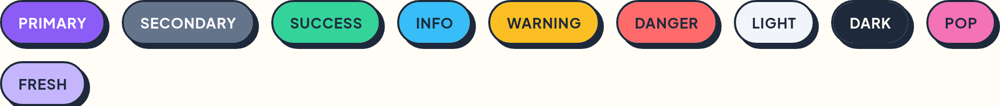

### Dark mode

The default skin's dark theme is **One Dark**: `#282c34` paper, `#abb2bf` ink, and borders
that step back to `#3e4451` so the 2px outlines read as structure rather than glare. It is
not an inversion of the light theme — an ink-filled block (a table head, a `<pre>`) goes
deeper via `--ja-ink-fill` instead of flipping to a light slab mid-page. The `brutal` skin
keeps its high-contrast dark, because that is the point of that skin.

Dark follows `prefers-color-scheme` on its own. Force it with `data-ja-theme="light" | "dark"`
on `<html>`, or from JavaScript:

```js
import { setTheme, toggleTheme, setStyle } from 'ja-ui';

toggleTheme();          // light <-> dark, remembered in localStorage
setTheme('system');     // back to following the OS
setStyle('brutal');     // switch skin
```


## JavaScript

Optional, ~5kb gzipped, no dependencies. Interactive components work from data attributes
alone — the script wires them up with one delegated listener:

```html
<button class="btn btn-primary" data-ja-toggle="modal" data-ja-target="#confirm">Delete</button>
<button class="btn-close" data-ja-dismiss="modal"></button>
```

Or drive them directly:

```js
import { Modal, Toast, Collapse } from 'ja-ui';

const modal = Modal.getOrCreateInstance('#confirm', { backdrop: 'static' });
modal.show();

document.querySelector('#confirm').addEventListener('ja:modal:hidden', () => {
  Toast.getOrCreateInstance('#saved', { delay: 4000 }).show();
});
```

| Component | Data attribute | Options |
| --- | --- | --- |
| `CommandPalette` | `data-ja-toggle="command-palette"` | `items`, `hotkey`, `placeholder`, `emptyText`, `groups`, `limit`, `keepOpen`, `backdrop`, `keyboard`, `clearOnClose`, `overscan`, `onSelect` |
| `DataTable` | `data-ja-datatable` | `columns`, `rows`, `columnCount`, `rowCount`, `defaultColumnWidth`, `minColumnWidth`, `maxAutoWidth`, `autoSizeSample`, `rowHeight`, `headerHeight`, `gutterWidth`, `overscan`, `selectable` |
| `Modal` | `data-ja-toggle="modal"` | `backdrop` (`true`/`false`/`'static'`), `keyboard`, `focus` |
| `Offcanvas` | `data-ja-toggle="offcanvas"` | `backdrop`, `keyboard`, `scroll` |
| `Collapse` | `data-ja-toggle="collapse"` | `parent`, `toggle` |
| `Dropdown` | `data-ja-toggle="dropdown"` | `autoClose` |
| `Tab` | `data-ja-toggle="tab"` | — |
| `Toast` | `data-ja-toggle="toast"` | `autohide`, `delay` |
| `Alert` | `data-ja-dismiss="alert"` | — |
| `Button` | `data-ja-toggle="button"` | — |

Events are namespaced `ja:<component>:<type>` — `show`, `shown`, `hide`, `hidden` (`show`
and `hide` are cancelable). Attributes are `data-ja-*`, never `data-bs-*`, so the JS half
never collides with Bootstrap if both are on the page.

### Command palette

The one component with no Bootstrap equivalent. It is built for desktop-shaped apps: a
global shortcut, fuzzy search over everything you can do, Enter to run it.

```js
import { CommandPalette } from 'ja-ui';

const palette = new CommandPalette('#palette', {
  hotkey: 'mod+k',                       // ⌘K on macOS, ctrl-K everywhere else
  items: () => [                         // a function is re-read on every open
    { label: 'Deploy to staging', description: 'acme-web', group: 'Actions', hint: '⌘D' },
    { label: 'Open user settings', group: 'Settings', keywords: 'profile theme' },
    ...files.map((path) => path),        // plain strings are items too
  ],
  onSelect: (item) => run(item),
});
```

```html
<div class="command-palette" id="palette" data-ja-hotkey="mod+k"
     data-ja-items="#palette-items"></div>
<script type="application/json" id="palette-items">[{ "label": "Deploy" }]</script>
```

| | |
| --- | --- |
| **Matching** | Subsequence search with fzf's bonuses — word boundaries, camelCase, tight runs beat scattered ones. Space-separated terms are ANDed, so `usr set` finds *User settings*. `description`, `keywords` and `group` are searched too, at a lower weight; `label` is what gets highlighted. |
| **Keys** | `↑`/`↓` and `ctrl-J`/`ctrl-K` (also `ctrl-N`/`ctrl-P`) move, `PageUp`/`PageDown` and `ctrl-U`/`ctrl-D` page, `Home`/`End` jump, `Enter` runs, `Escape` closes. The selection wraps and skips `disabled` items. |
| **Mouse** | A pointer already resting over the list when the palette opens does **not** take the selection — hover only takes over once the mouse genuinely moves. Opening under the cursor never runs the wrong thing. |
| **Motion** | One highlight block slides between rows; it jumps rather than animating when the result set changes, because that is not a move. Keyboard navigation scrolls instantly while the highlight animates — a smooth-scrolling list racing an animating highlight is what makes most palettes feel soupy on a held-down arrow key. |
| **Scale** | Only the visible window is in the DOM, and rows are recycled as you scroll. Each keystroke re-filters inside the previous result set, so a 100,000-item list filters in ~25 ms on the first character and under 10 ms after that. |

Row heights come from CSS (`--ja-command-palette-item-height`,
`--ja-command-palette-header-height`) and are measured by the JS, so they must stay in `px`.

### Data table

The plain `.table` remains the dumb markup-first table. `DataTable` is the heavy-duty sibling for
spreadsheet-sized data: rows and columns are virtualised, every column starts at a fixed width,
dragging its edge resizes it, and a double-click auto-sizes it up to a cap so a giant JSON blob
does not blow the whole sheet open.

```js
import { DataTable } from 'ja-ui';

new DataTable('#orders', {
  columnCount: 1000,
  rowCount: 1000000,
  defaultColumnWidth: 160,
  maxAutoWidth: 320,
  getColumnLabel: (index) => `Field ${index + 1}`,
  getCell: (rowIndex, columnIndex) => `R${rowIndex + 1} · C${columnIndex + 1}`,
});
```

If your data already fits in JSON, the constructor also reads `data-ja-columns` / `data-ja-rows`
selectors that point at `<script type="application/json">` blocks:

```html
<script type="application/json" id="dt-columns">["SKU","Name","Warehouse"]</script>
<script type="application/json" id="dt-rows">[["A-100","Travel mug","Manchester"]]</script>
<div id="orders" data-ja-datatable data-ja-columns="#dt-columns" data-ja-rows="#dt-rows"></div>
```

`DataTable` emits `ja:datatable:columnresize` / `ja:datatable:columnresized`,
`ja:datatable:autosize` / `ja:datatable:autosized`, and `ja:datatable:selectall` /
`ja:datatable:selectallchanged`.

`CommandPalette` emits `ja:command-palette:show` / `shown` / `hide` / `hidden`, plus `filter`,
`highlight` and a cancelable `select` carrying `{ item, index, query }`.

TypeScript definitions ship in the package.

## Browser support

Modern evergreen browsers. ja-ui uses `color-mix()`, `:has()`, cascade layers, logical
properties, `oklch`-free but modern colour handling, and container-friendly modern
layout. There is no IE support, no float-based grid, and no clearfix.

## Development

```bash
npm install
npm run dev             # Storybook on :6006
npm run build           # dist/ — css, esm, iife, types
npm run smoke           # drive every JS component in a real browser
npm run gen             # regenerate the derived CSS (grid, variants, utilities)
npm run docs:images     # rebuild every screenshot and GIF in this README
npm run site            # rebuild the published site into docs/
npm run site:serve      # preview it on :6008
```

The playground at
[cleancookie.github.io/ja-ui](https://cleancookie.github.io/ja-ui/) is the committed
`docs/` folder — Pages serves it straight off `main`, with no CI step in the loop. It is
assembled from `site/` (the landing page), `examples/`, `dist/` and the built Storybook.
Run `npm run site` and commit `docs/` whenever a change should show up on the site;
nothing in it uses absolute paths, so it works from any base path.

`docs/images/` is the exception: those are the README screenshots, written by
`npm run shots`, and the site build leaves them alone.

The CSS is authored by hand in `src/styles/**`, except the repetitive parts — the grid,
the per-colour variants and the utility classes — which are generated by the scripts in
`tools/` so a palette change stays a one-line edit.

```
src/
  styles/
    base/        tokens, reset, typography
    layout/      stacks, ratios, sticky, visually-hidden
    components/  one file per component, structure only
    generated/   grid, colour variants, utilities  (npm run gen)
  js/            one module per interactive component
tools/           CSS generators, screenshot + GIF capture, smoke test, site build
examples/        standalone template pages
site/            the playground landing page
stories/         Storybook
```

## Licence

MIT
